# 🛒 Amazon Price Prediction (R)

Predict **discounted_price** for Amazon products using features like
**rating, rating_count, actual_price, and discount_percentage**.  
Built fully in **R** with end-to-end steps: **data cleaning → EDA → text & sentiment → regression modeling**
(Linear, Ridge, Lasso, Elastic Net via `glmnet`).

  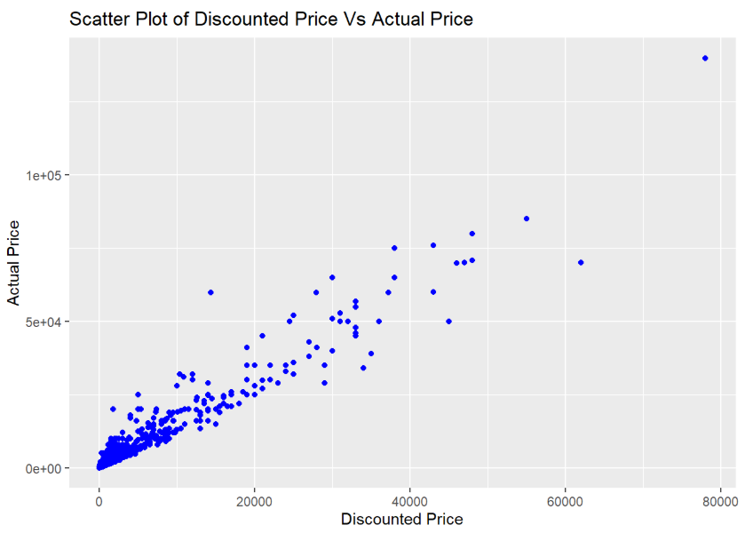
  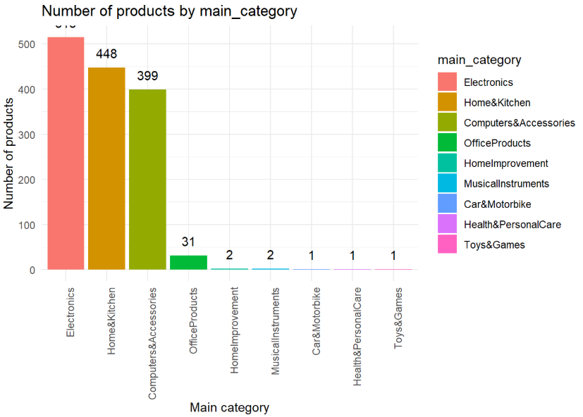

---

## 🎯 Goals
- Reproducible R workflow for price prediction
- Understand price drivers via **EDA** and **correlation**
- Use **review text** (tokenization + sentiment) for richer signals
- Compare **Linear / Ridge / Lasso / Elastic Net** and report performance

---

## 🚀 Highlights
- **Cleaning:** currency/percent stripping, type conversions, de-dupe, NA imputation  
- **Feature engineering:** `main_category` extraction from hierarchical category strings  
- **EDA:** histograms, scatter plots, category distributions, correlation heatmap  
- **Text & sentiment:** tokenization, stopwords removal, **bing** lexicon, word cloud  
- **Models:** Linear, **Ridge**, **Lasso**, **Elastic Net** with cross-validation  
- **Evaluation:** MSE, RMSE, MAE, R², Adjusted R² + side-by-side comparison

---

## 🧰 Tech Stack
**R** · `tidyverse`, `ggplot2`, `dplyr`, `caret`, `glmnet`, `heatmaply`, `plotly`, `tm`, `tidytext`,  
`wordcloud`, `textstem`, `kableExtra`, `knitr`, `rmarkdown`, `webshot`, `webshot2`

---

## ▶️ How to Run

**In RStudio**
1. Open `amazon_price_prediction.R`
2. Run the script (it already includes package installs if missing)
3. Outputs/plots will be generated during execution

## 🖼️ Visuals

<!-- Hero: strongest pair --> 
   
 <!-- EDA grid --> 
 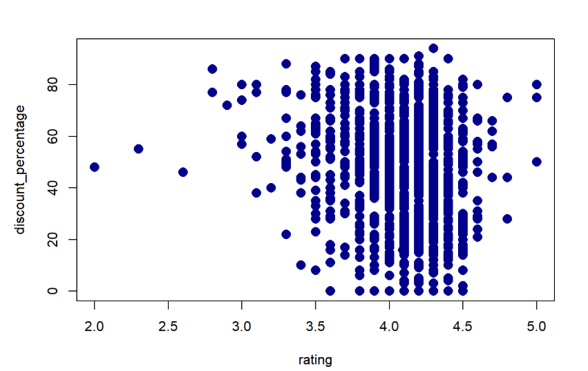 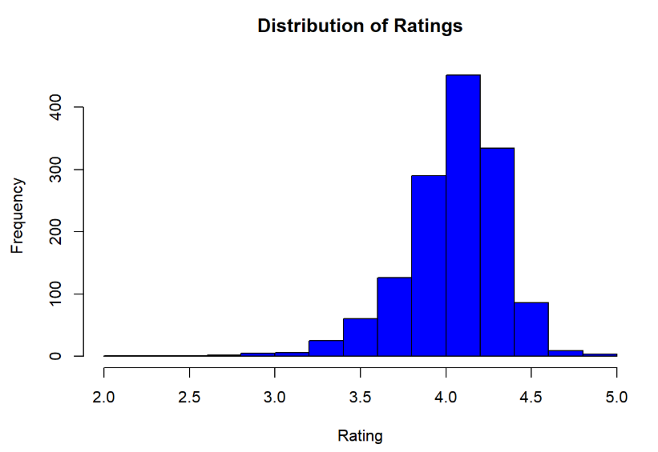 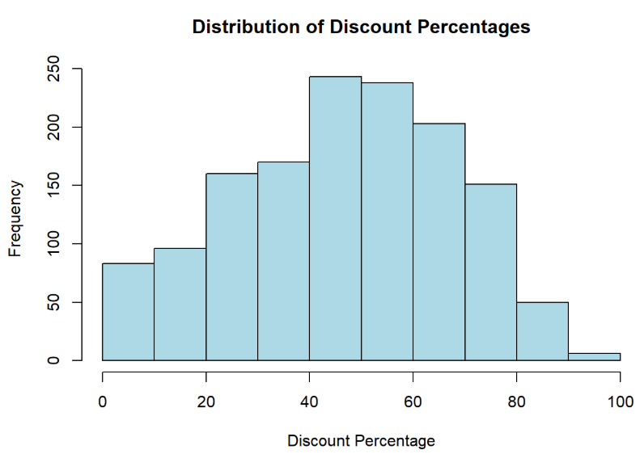 
 
 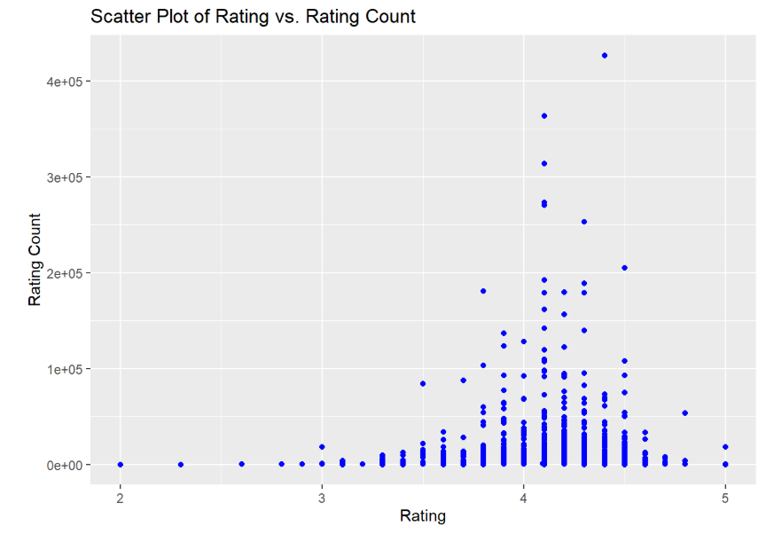 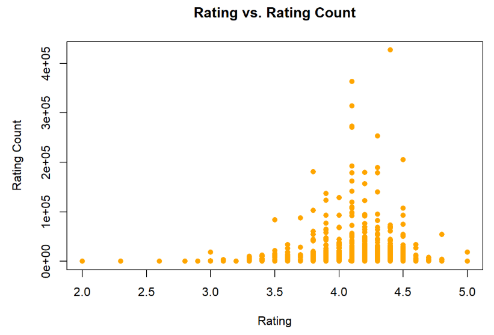 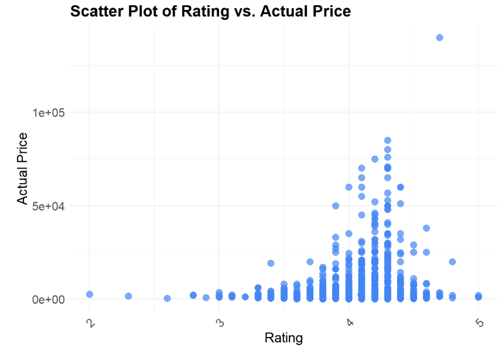 
 <!-- Category mix --> 
 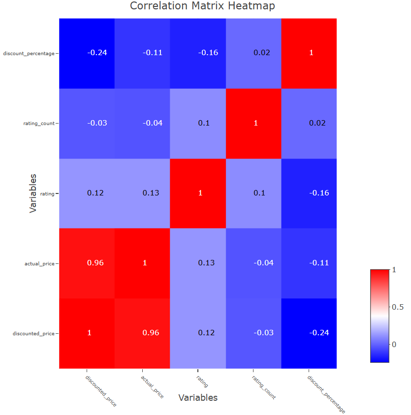 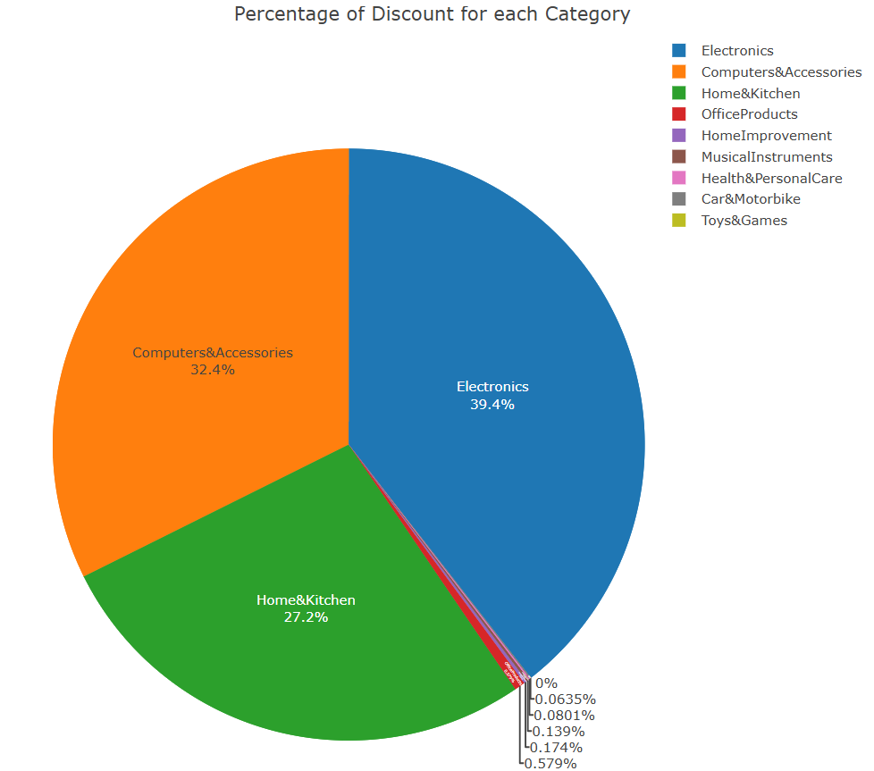 
 
 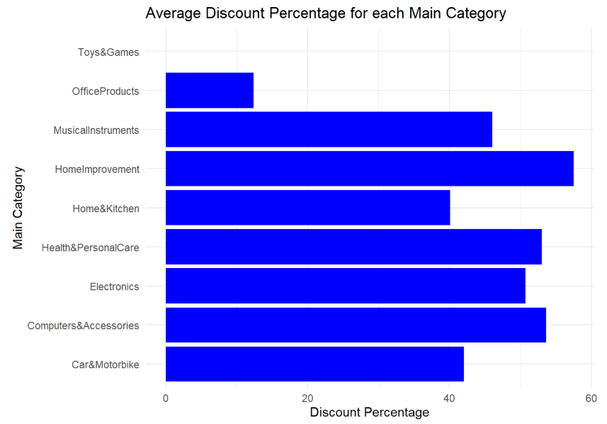 
 <!-- Text & sentiment --> 
 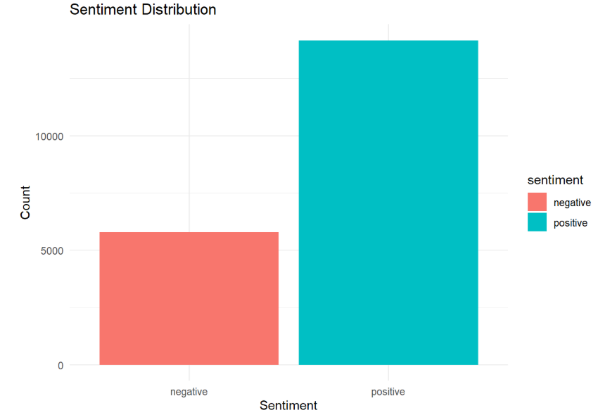 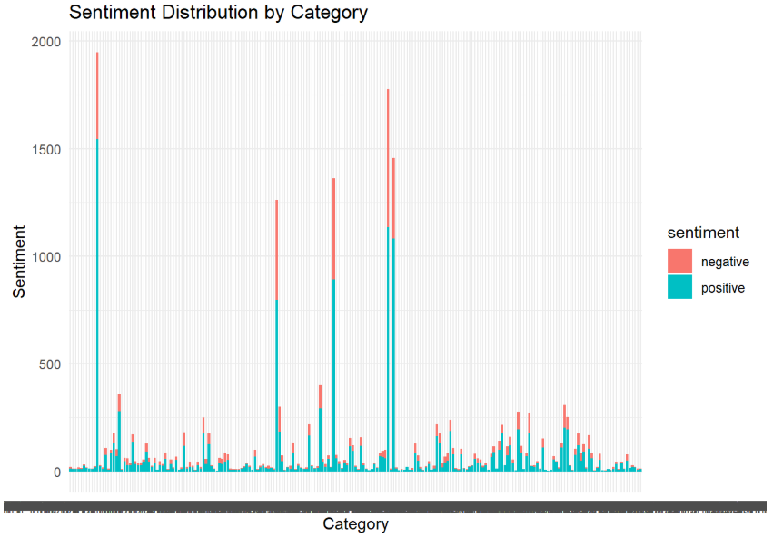 
 
  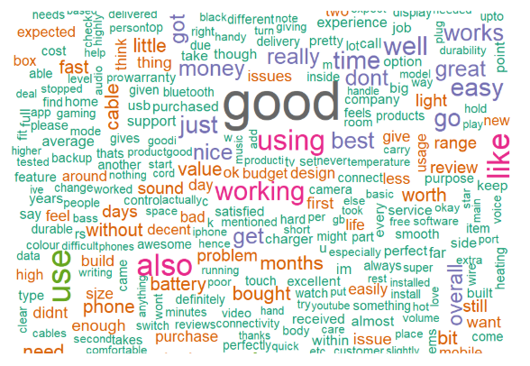 

## 📈 Model Results

 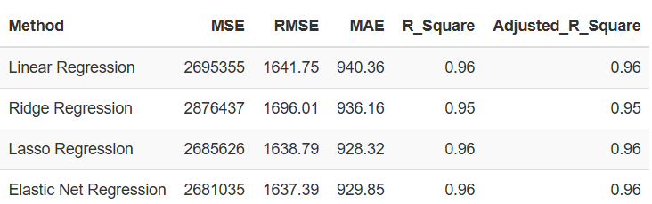 

Quick takeaways

-Elastic Net delivers the lowest overall error (RMSE/MSE)
-Lasso has the lowest MAE by a small margin
-All models show strong fit (R² ≈ 0.95–0.96 on this feature set)

##💡 Insights from EDA & Sentiment

-Price relationship: discounted_price and actual_price are strongly positively related
-Ratings: cluster around 3.6–4.4
-Engagement: higher ratings often come with higher rating_count, with wide variance
-Category mix: dominated by Electronics, Home&Kitchen, Computers&Accessories; discount levels vary by category
-Sentiment: positive reviews dominate overall and align with higher rating bands
-Text themes: frequent terms include good, using, value, working, also, use
